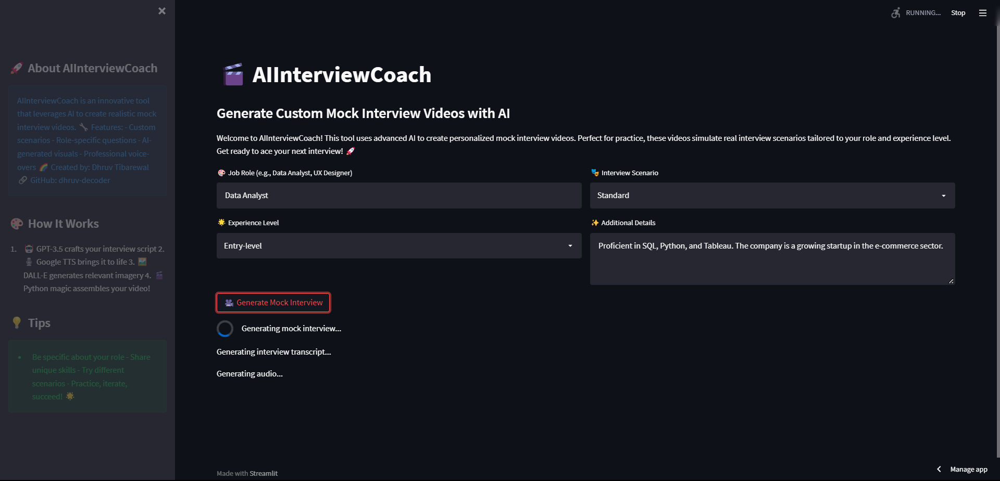

# AllInterviewCoach

AllInterviewCoach is an innovative solution designed to help students and job seekers prepare for interviews more effectively. Developed during an internship at Blockverse, this project leverages the power of artificial intelligence (AI) to generate realistic mock interview scenarios, complete with transcripts and video simulations.

## Table of Contents

- [Features](#features)
- [Tech Stack](#tech-stack)
- [Installation](#installation)
- [Usage](#usage)
- [How It Works](#how-it-works)
- [Tips](#tips)
- [Contributing](#contributing)
- [License](#license)

## Features

- **Custom Scenarios**: Generate personalized mock interview scripts tailored to specific roles and experience levels.
- **Role-specific Questions**: Focus on job-specific questions to enhance preparation.
- **AI-generated Visuals**: Create realistic and professional images to simulate interview environments.
- **Professional Voice-overs**: Use text-to-speech technology to create realistic interview audio.

## Tech Stack

- **Programming Languages**: Python
- **Libraries**: 
  - `streamlit` for the web interface
  - `openai` for generating interview scripts
  - `gtts` for text-to-speech conversion
  - `PIL` for image processing
  - `moviepy` for video creation
  - `cv2` for image handling
  - `requests` for API calls
- **APIs**: 
  - OpenAI API
  - Hugging Face API for image generation
- **Tools**:
  - Docker for containerization

## Installation

1. **Clone the repository**:
    ```bash
    git clone https://github.com/dhruv-decoder/AllInterviewCoach.git
    cd AllInterviewCoach
    ```

2. **Create a virtual environment**:
    ```bash
    python -m venv venv
    source venv/bin/activate  # On Windows, use `venv\Scripts\activate`
    ```

3. **Install the dependencies**:
    ```bash
    pip install -r requirements.txt
    ```

4. **Set up your API keys**:
    - Add your OpenAI and Hugging Face API keys to `secrets.toml` in the `.streamlit` folder:
    ```toml
    [general]
    OPENAI_API_KEY = "your_openai_api_key"
    HUGGINGFACE_API_KEY = "your_huggingface_api_key"
    ```

## Usage

1. **Run the Streamlit app**:
    ```bash
    streamlit run app.py
    ```

2. **Fill in the required fields** on the web interface:
    - **Job Role**: e.g., Data Analyst, UX Designer
    - **Experience Level**: Entry-level, Mid-level, Senior
    - **Interview Scenario**: Standard, Technical, Behavioral
    - **Additional Details**: Skills, company information, etc.

3. **Generate the Mock Interview**: Click on "Generate Mock Interview" to create your personalized interview video.

## How It Works

1. **Transcript Generation**:
    - Uses GPT-3.5 to create a realistic interview script based on the user's inputs.

2. **Audio Generation**:
    - Converts the generated script into audio using Google TTS.

3. **Image Generation**:
    - Uses the Hugging Face API to create relevant and professional images.

4. **Video Creation**:
    - Combines the generated audio and images into a video using MoviePy.

## Tips

- **Be Specific**: Provide detailed information about the role and your skills.
- **Try Different Scenarios**: Experiment with various interview scenarios to get comprehensive practice.
- **Practice**: Use the generated videos to practice and improve your interview skills.

## Contributing

Contributions are welcome! Please fork the repository and submit a pull request for any enhancements or bug fixes.


